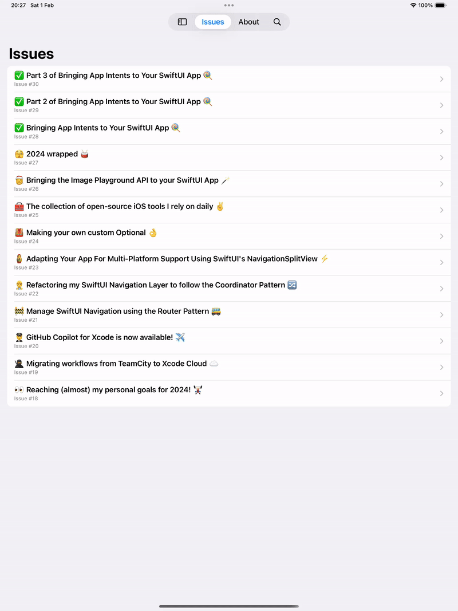

# Tab Bar with sidebar on iOS 18

Hi! 👋

This is the sample app for the issue #34: [😎 Using SwiftUI's Improved TabView with Sidebar on iOS 18 🙌](https://www.ioscoffeebreak.com/issue/issue34) of the iOS Coffee Break, where I share insights into how Apple manages tab bars and sidebars with the latest SwiftUI APIs.

 

  

Have a nice day,
 
Tiago
